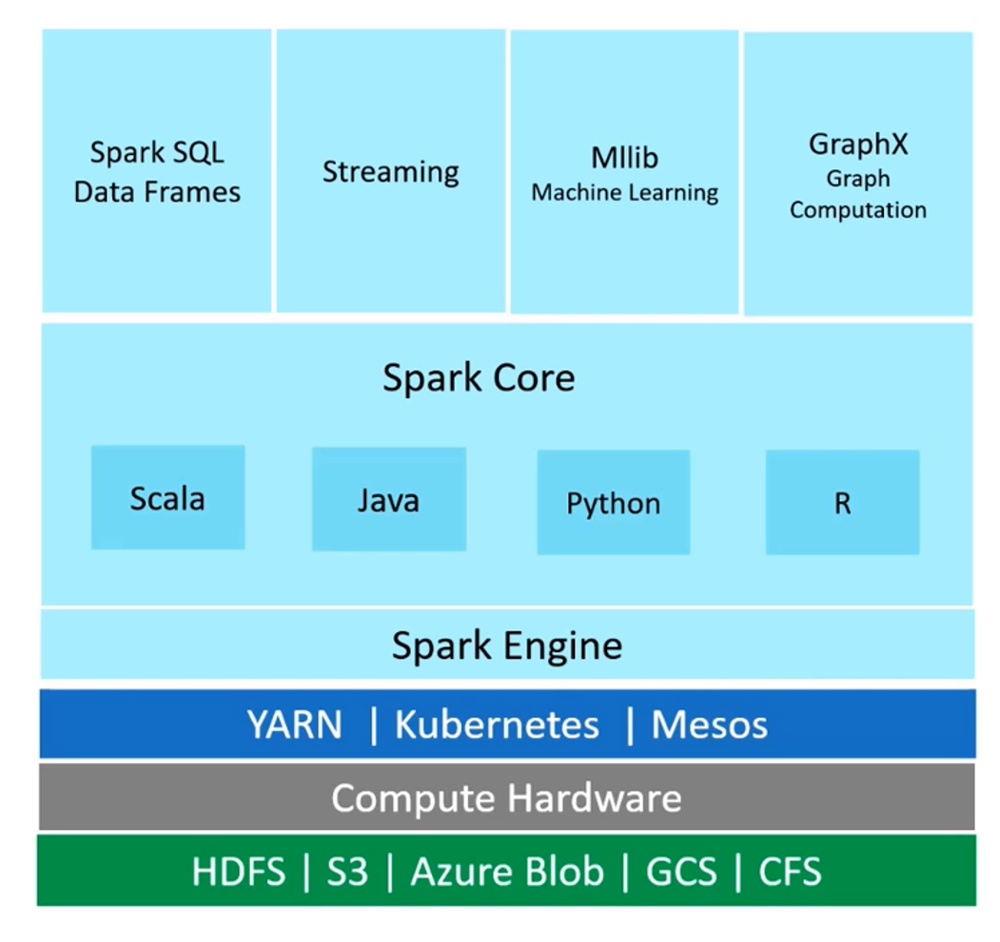
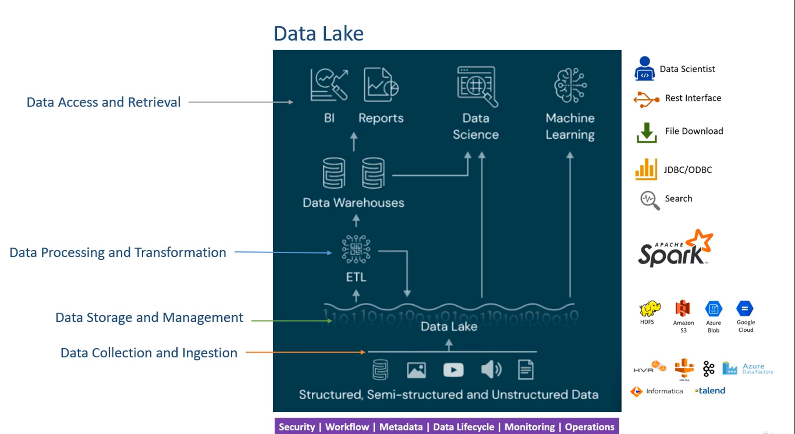

# Big Data

#### Evolution of Data and Big Data

Data Processing was done with RDBMS for decades. RDBMS offered SQL, PL SQL and an interface for other programming languages, such as JDBC and ODBC.

Data evolved from structured data (tables) to semi-structured (JSON and XML), storing and managing semi-structured data in relational databases is complex. Finally evolved to unstructured data, such as text, doc, images, and videos.

#### Types of Data

**Structured:** tables with rows and columns

**Semi-structured:** JSON and XML with key-value pairs

**Un-structured:** files such as text, images and videos

#### 5 V's

Data processing applications should handle the big data problem.

1. **Variety:** encompasses the different formats and types of data.
2. **Volume:** refers to the massive amount of data generated and stored. can be terabytes, petabytes and even exabytes
3. **Velocity:** the speed at which data is generated, processed and analysed.
4. **Veracity:** focuses on accuracy, quality and reliability of the data.
5. **Value:** represents the potential insights and business value that can be extracted from the data.

#### Approaches of Big Data Solution

1. Vertical Scaling - Monolithic
2. Horizontal Scaling - Distributed

#### Hadoop

A distributed Big Data processing platform that offers three core capabilities.

1. YARN (Yet another resource negotiator) - Cluster Operating System
2. HDFS (Hadoop Distributed File System ) - Distributed Storage
3. MapReduce - Distributed Computing

Other:

1. Hive - Create DBs, Tables and Views and run SQL queries
2. Apache Pig - high-level scripting
3. HBASE - NoSQL

##### Drawbacks of Hadoop

1. Performance - MapReduce is slow. Hive queries are slower than RDBMS queries.
2. Ease of development - MapReduce was adopted only by highly skilled developers 
3. Language support - supports only Java.
4. Storage and Resource Management - became expensive as cloud storage became more and more accessible.

#### Apache Spark

an opensource, distributed processing framework designed for large-scale data processing and analytics.

**Pros:**

1. Abstraction
2. Unified Platform
3. Ease of Use

#### Spark vs Hadoop

1. Performance: 10 to 100 times faster than M/R
2. Ease of development:  
   - Spark SQL
   - High-performance SQL engine
   - Composable Function API
3. Language support
    - Java, Scala, Python and R
4. Storage - HDFS and Cloud Storage
5. Resource Management - YARN, k8s

### Data Warehouse, Data Lake and Lakehouse

1. Data Warehouse: Enterprise data platform used for the analysis and reporting of structured and semi-structured data from multiple data sources.

2. DataLake: Centralized repository that ingests and stores large volumes of data in its original form. The data can then be processed and used as a basis for a variety of analytic needs.

3. Data Lakehouse: an open data management architecture that combines the flexibility, cost-efficiency, and scale of data lakes with the data management and ACID transactions of data warehouses.

